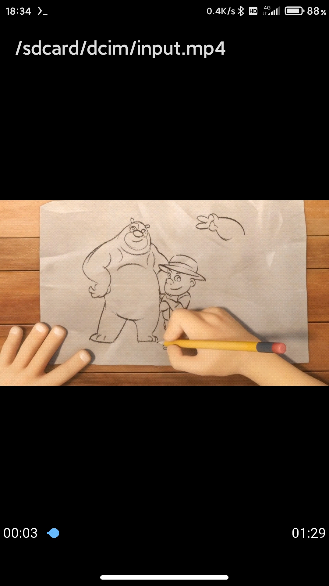
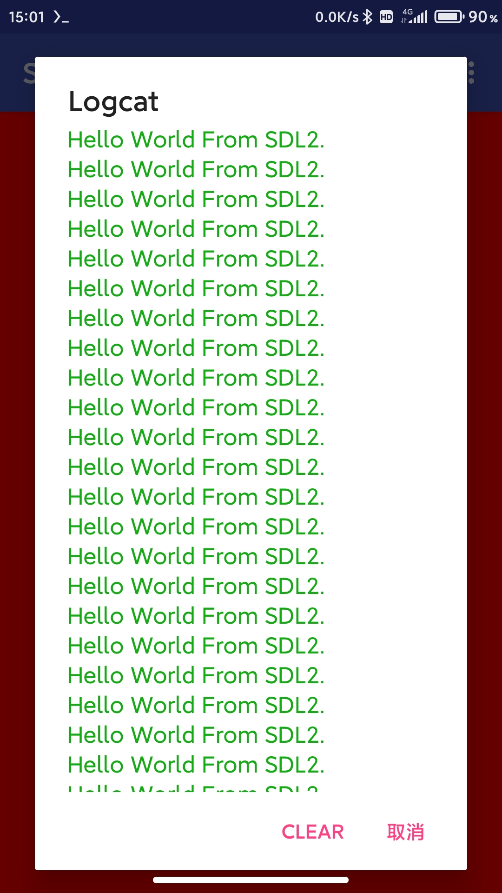

### termux-sdl

This is a termux sdl plugin for compiling and running SDL2 and native app.

#### How to compiling SDL2 and native program:

```bash
# compile examples
cd examples/SDL2/draw2

# create build directory
mkdir build && cd build

# execute cmake 
cmake ..

# start running
make run

# compile your own program, please refer to examples 

```
----

<div align="left">
    
</div>

----
#### Using github actions to auto building debug app
If you want to use github actions to build debug app.</br>
please fork this repository, then execute the command as below.

```bash
# add a tag v2.5 v3.0 ..etc
git tag -a v3.0 -m "release 3.0 version" 

# push tag to trigger the github actions
git push origin --tag

```
----

#### Using ffplay to play video and audio

At the same time, I added ffplay, so it can also be used as a local player.</br>

ffplay has implemented a progress bar and time display.</br>
swipe the left side of the screen to control the brightness, swipe the right side of the screen to control the volume.</br>
the progress bar is drawn by SDL2_gfx, the time is drawn by SDL2_ttf.

```bash
# copy ffplay to /data/data/com.termux/files/usr/bin
cp example/SDL2/ffplay/ffplay /data/data/com.termux/files/usr/bin
chmod 755 /data/data/com.termux/files/usr/bin/ffplay

# play video
ffplay -i /sdcard/video/test.mp4

# play music whit 1.5x speed
ffplay -af atempo=1.5 -i /sdcard/music/hello.flac

# 2x speed playback
ffplay -af atempo=2.0 -vf setpts=1/2*PTS -i /sdcard/video/test.mp4

# play at any speed: atempo=x setpts=1/x*PTS

# no window title(set title is null)
ffplay -window_title -i /sdcard/video/test.mp4

# full screen
ffplay -fs -i /sdcard/video/test.mp4

```

----

How to use `SDL_AndroidLogPrint` method click [here](https://github.com/Lzhiyong/termux-sdl/blob/master/examples/SDL2/testlog/test_log.c) for example.

<div align="left">
    
</div>

----
### Issues
* There are still some problems with ffplay, 
when playing at playback speed, drag the progress bar, the time is inaccurate, and the video and audio are not synchronized.

* You can also add some external libraries, such as libx264 libx265 fdk-aac etc, to better support ffplay.

